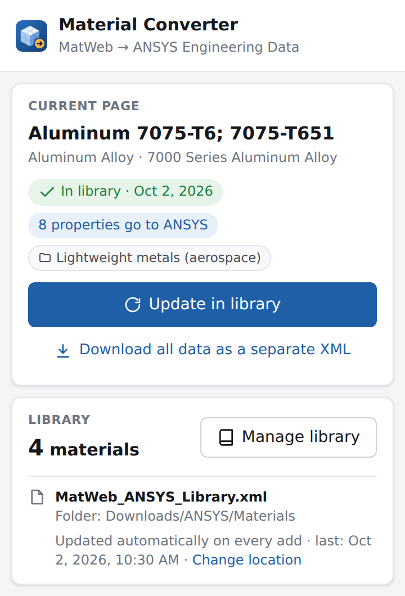
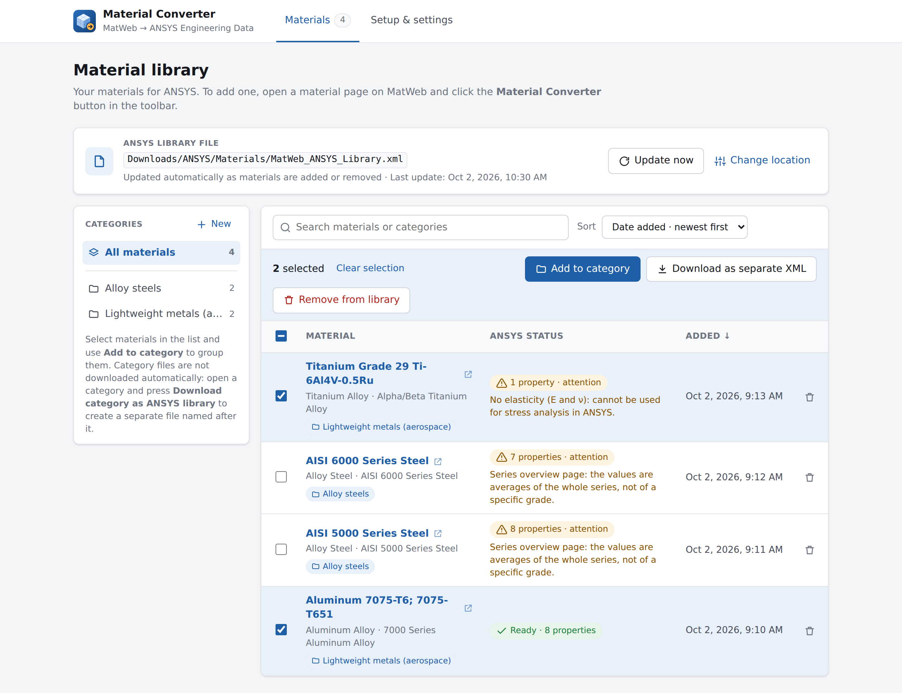
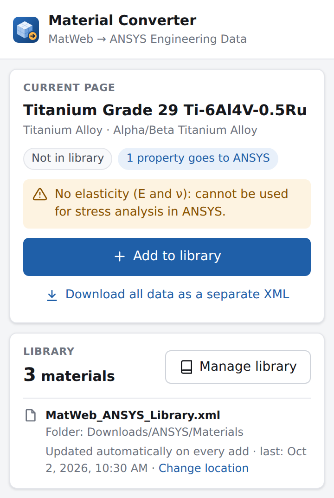
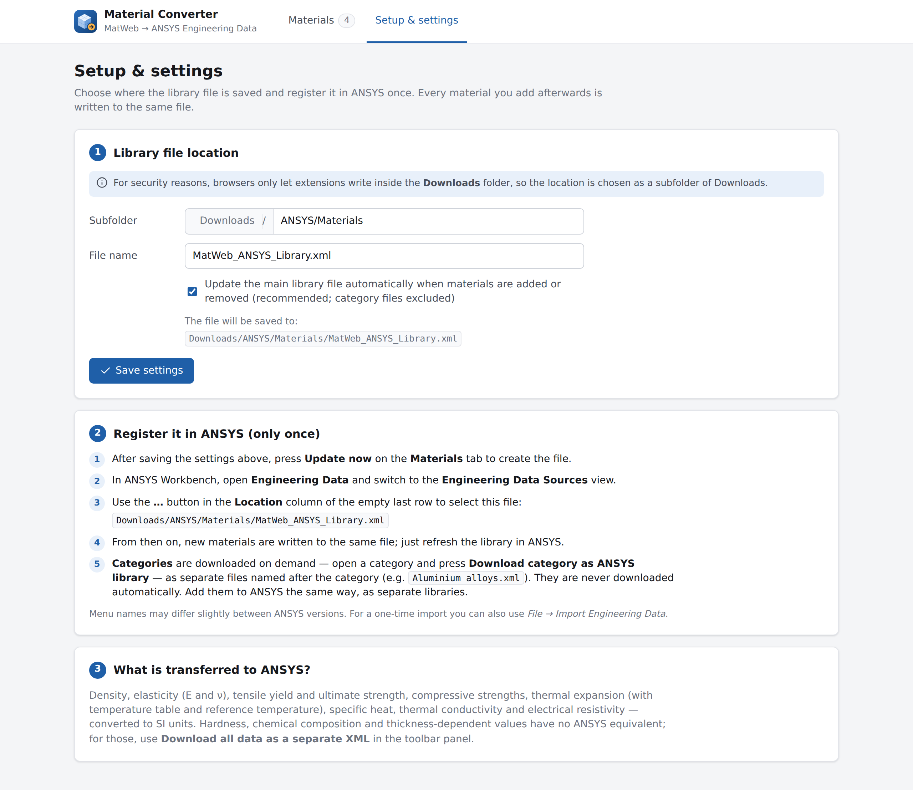
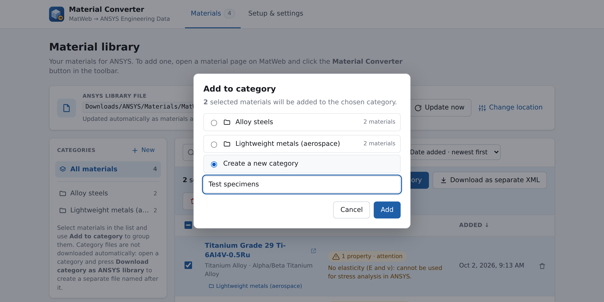
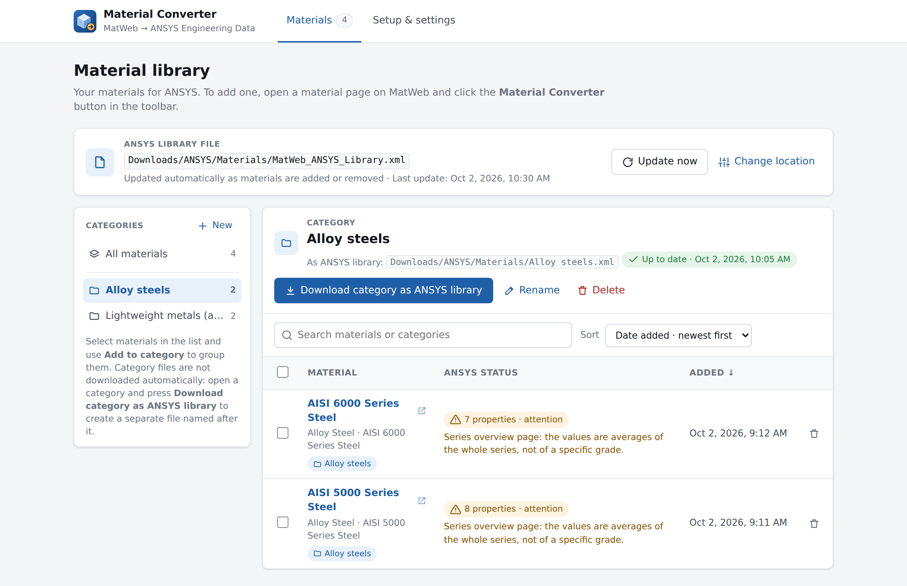
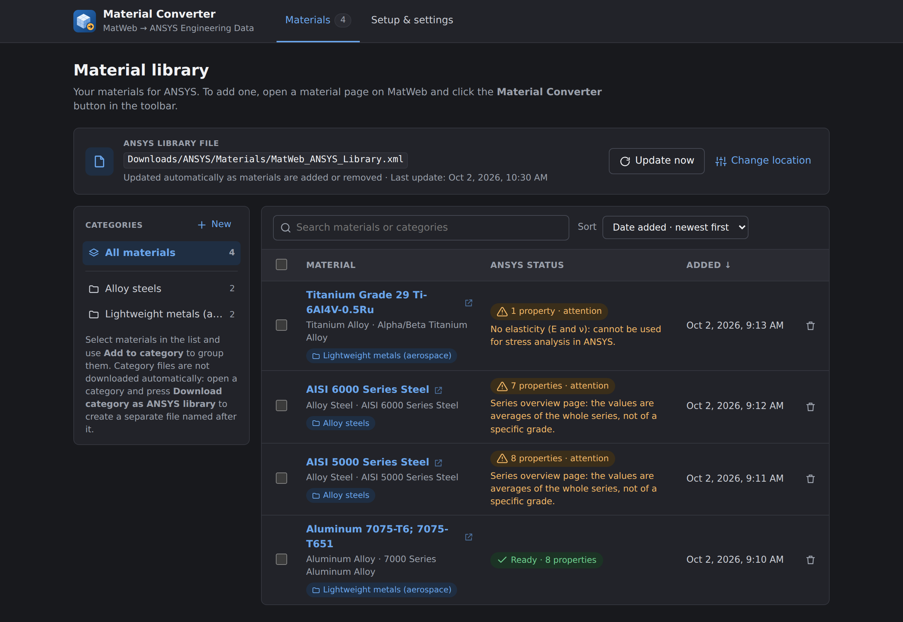

  

<h1 align="center">Material Converter</h1>

  <b>Turn MatWeb material data sheets into an ANSYS Engineering Data library — in one click.</b> 
  A free browser extension for Firefox, Google Chrome and Microsoft Edge.

  
  &nbsp;&nbsp;
  

---

## Why?

Copying material properties from MatWeb into ANSYS by hand is slow and error-prone: unit conversions, ranges,
temperature-dependent values, typos. Material Converter does it for you. Open a material page, click one button,
and the material appears in an ANSYS library file that Workbench reads directly.

## Features

- **One-click import** — on any MatWeb material data sheet, click the toolbar button and press **Add to library**.
- **Ready for ANSYS** — values are converted to SI units and written in the ANSYS Engineering Data format: density,
  elasticity (E, ν), yield and ultimate strength, thermal expansion with temperature table, specific heat,
  thermal conductivity and electrical resistivity.
- **One library file, always up to date** — every material you add goes into the same file. Register it in ANSYS once;
  after that, just refresh.
- **Your own categories** — group materials (e.g. *Alloy steels*, *Lightweight metals*) and download any category as
  its own ANSYS library, named after the category.
- **Smart warnings** — you are told when a page is missing data ANSYS needs (e.g. no Young's modulus) or when it is a
  series overview with averaged values instead of a specific grade.
- **Library manager** — search, sort by name, category or date, open the original data sheet with one click, export
  a selection as a separate file.
- **Full data export** — need hardness, chemical composition or thickness-dependent values? Download everything on the
  page as a separate, detailed XML file.
- **Private by design** — everything runs locally in your browser. No account, no server, no tracking.
- **English and Turkish** — the interface follows your browser language.

## Download

Get the latest version from the **[Releases page](../../releases/latest)**:

| Browser | File |
|---|---|
| Firefox | `Material_Converter-firefox-<version>.zip` |
| Google Chrome, Microsoft Edge | `Material_Converter-chromium-<version>.zip` |

## Installation

### Google Chrome

1. Unzip `Material_Converter-chromium-<version>.zip` into a folder you will keep.
2. Go to `chrome://extensions` and switch on **Developer mode** (top right).
3. Click **Load unpacked** and select the unzipped folder.
4. Click the puzzle icon in the toolbar and **pin** Material Converter.

### Microsoft Edge

1. Unzip `Material_Converter-chromium-<version>.zip` into a folder you will keep.
2. Go to `edge://extensions` and switch on **Developer mode** (left side).
3. Click **Load unpacked** and select the unzipped folder.
4. Click the extensions icon and choose **Show in toolbar** for Material Converter.

### Firefox

1. Go to `about:debugging#/runtime/this-firefox`.
2. Click **Load Temporary Add-on…** and select `Material_Converter-firefox-<version>.zip`.
3. Click the puzzle icon in the toolbar and pin Material Converter.

> Firefox removes temporary add-ons when it closes. For a permanent installation the add-on has to be signed by Mozilla
> (free, it does not have to be published in the store).

When the extension is installed for the first time, the **Setup & settings** page opens automatically.

## How to use

### 1. Add materials

Open a material data sheet on MatWeb and click the **Material Converter** button in your toolbar. The panel shows the
material, how many properties will be transferred to ANSYS and any warnings. Press **Add to library** — that's it.

  
  &nbsp;&nbsp;
  

### 2. Connect the library to ANSYS (once)

Open **Manage library → Setup & settings**, choose where the library file is saved and follow the steps on the page:
in ANSYS Workbench, open **Engineering Data → Engineering Data Sources** and add the file as a library.
From then on every material you add is written to the same file — just refresh the library in ANSYS.

  

> Browsers only allow extensions to save files inside your **Downloads** folder, so the library location is a subfolder
> of Downloads (for example `Downloads/ANSYS/Materials`).

### 3. Organize with categories

On the library page, select materials and press **Add to category** — pick an existing category or type a new name.
Open a category and press **Download category as ANSYS library** to get a separate file named after the category,
which you can add to ANSYS as its own library. Category files are only downloaded when you ask for them.

  

  

The interface also has a dark theme that follows your system setting.

  

## Good to know

- **Specific grades work best.** MatWeb's series overview pages (e.g. "AISI 4000 Series Steel") list ranges for a whole
  family of materials; the extension uses their averages and warns you. For analysis, prefer a specific grade and condition.
- **What is not transferred.** Hardness, chemical composition and thickness-dependent values have no equivalent in
  ANSYS Engineering Data. Use **Download all data as a separate XML** if you need them.
- **Check your data.** Always review material properties before using them in an engineering analysis.

## Privacy

Material Converter does not collect or send any data. See the [privacy policy](PRIVACY.md).

## Disclaimer

Material Converter is an independent project. It is **not affiliated with, endorsed by or sponsored by MatWeb, LLC or
ANSYS, Inc.** MatWeb and ANSYS are trademarks of their respective owners and are mentioned only to describe what the
extension works with. The extension only reads pages that you open yourself; you are responsible for using the data in
accordance with the source website's terms of use.

## License

[MIT](LICENSE) © 2026 Koray Akdoğan

## Technical details

Architecture, the ANSYS property mapping, the XML formats, building from source and the test setup are described in
**[docs/TECHNICAL.md](docs/TECHNICAL.md)**.
