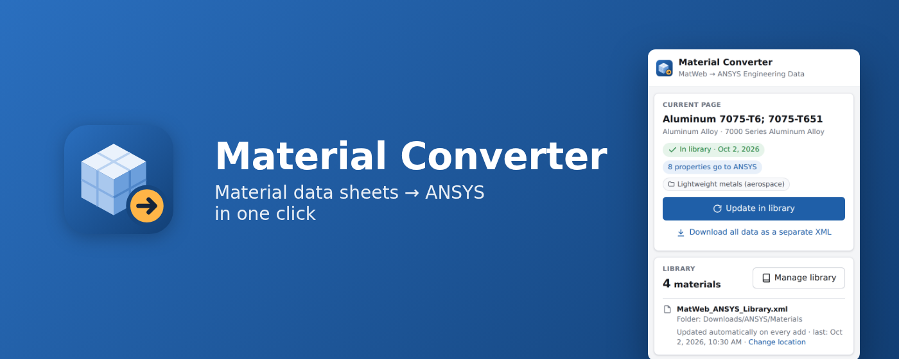
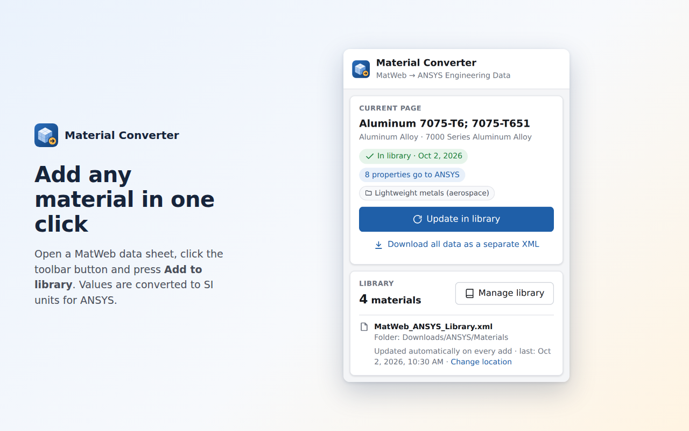
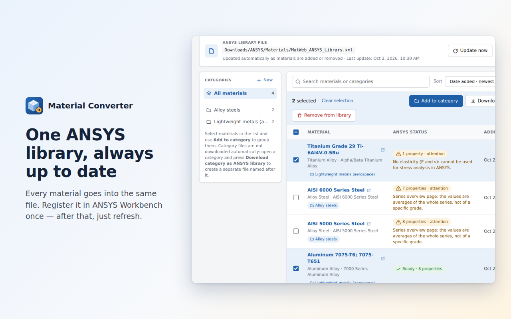
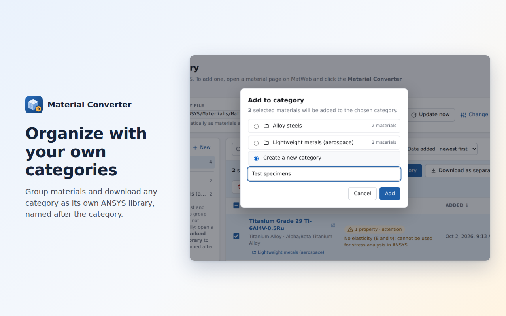
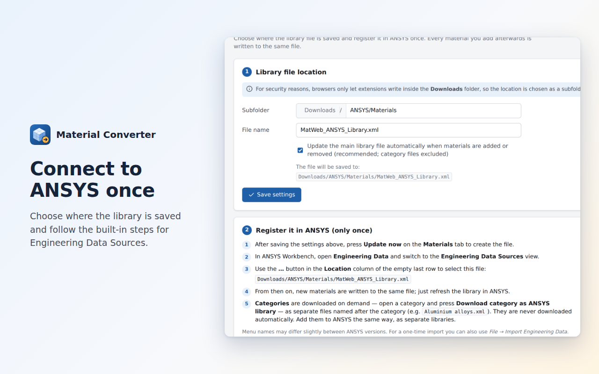
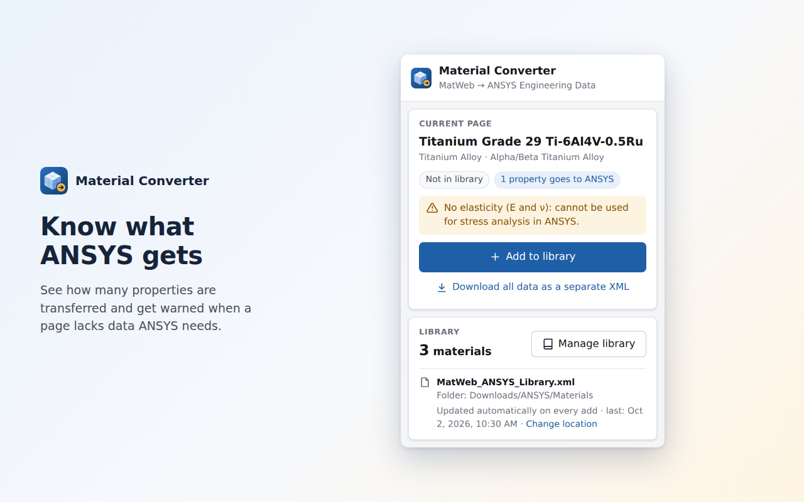

  

  <b>Turn MatWeb material data sheets into an ANSYS Engineering Data library — in one click.</b> 
  A free, open-source browser extension for Firefox, Google Chrome and Microsoft Edge.

  
  
  
  
  
  

  <a href="#install"><b>Install</b></a> ·
  <a href="#how-it-works"><b>How it works</b></a> ·
  <a href="#features"><b>Features</b></a> ·
  <a href="#privacy"><b>Privacy</b></a> ·
  <a href="docs/TECHNICAL.md"><b>Technical details</b></a>

---

Copying material properties into ANSYS by hand is slow and error-prone: unit conversions, ranges,
temperature-dependent values, typos. **Material Converter does it for you.** Open a material page, click one button,
and the material appears in an ANSYS library file that Workbench reads directly.

<table>
  <tr>
    <td align="center" width="33%"><h3>⚡ One click</h3>Open a data sheet, press <b>Add to library</b>. Done.</td>
    <td align="center" width="33%"><h3>🎯 Ready for ANSYS</h3>SI units, Engineering Data format, temperature tables included.</td>
    <td align="center" width="33%"><h3>🔒 100% local</h3>No account, no server, no tracking. Your data stays on your computer.</td>
  </tr>
</table>

## How it works

### 1 · Add a material in one click

Open any material data sheet on MatWeb and click the **Material Converter** button in your toolbar. The panel shows
the material, how many properties go to ANSYS and any warnings. Press **Add to library** — that's it.

  

### 2 · Manage your whole library

Search, sort by name, category or date, open the original data sheet with one click, and export a selection as a
separate file. Every material goes into **one library file** that is updated automatically.

  

### 3 · Organize with your own categories

Select materials and press **Add to category** — pick an existing category or type a new name. Download any category
as its own ANSYS library, named after the category. Category files are only downloaded when you ask for them.

  

### 4 · Connect to ANSYS once

Choose where the library is saved, then add it in ANSYS Workbench under **Engineering Data → Engineering Data
Sources**. From then on, just refresh the library in ANSYS to see new materials.

  

### 5 · Know what you are getting

Material Converter tells you when a page is missing data ANSYS needs (e.g. no Young's modulus) or when it is a series
overview with averaged values instead of a specific grade.

  

## Features

| | |
|---|---|
| **One-click import** | From any MatWeb material data sheet, straight from the toolbar. |
| **Ready for ANSYS** | Density, elasticity (E, ν), yield and ultimate strength, thermal expansion with temperature table, specific heat, thermal conductivity and electrical resistivity — converted to SI units. |
| **One library file** | Register it in ANSYS once; it is rewritten automatically every time you add a material. |
| **Categories** | Group materials and download any category as its own ANSYS library. |
| **Smart warnings** | Missing data and series-average pages are flagged before you use them. |
| **Library manager** | Search, sort, open the source page, export a selection. |
| **Full data export** | Hardness, chemical composition and conditional values as a separate detailed XML. |
| **English & Turkish** | The interface follows your browser language, with light and dark themes. |

## Install

Download the package for your browser from the **[latest release](../../releases/latest)**:

| Browser | File |
|---|---|
| Firefox | `Material_Converter-firefox-<version>.zip` |
| Google Chrome, Microsoft Edge | `Material_Converter-chromium-<version>.zip` |

<b>Google Chrome</b>

1. Unzip `Material_Converter-chromium-<version>.zip` into a folder you will keep.
2. Go to `chrome://extensions` and switch on **Developer mode** (top right).
3. Click **Load unpacked** and select the unzipped folder.
4. Click the puzzle icon in the toolbar and **pin** Material Converter.

<b>Microsoft Edge</b>

1. Unzip `Material_Converter-chromium-<version>.zip` into a folder you will keep.
2. Go to `edge://extensions` and switch on **Developer mode** (left side).
3. Click **Load unpacked** and select the unzipped folder.
4. Click the extensions icon and choose **Show in toolbar** for Material Converter.

<b>Firefox</b>

1. Go to `about:debugging#/runtime/this-firefox`.
2. Click **Load Temporary Add-on…** and select `Material_Converter-firefox-<version>.zip`.
3. Click the puzzle icon in the toolbar and pin Material Converter.

Firefox removes temporary add-ons when it closes. For a permanent installation the add-on has to be signed by Mozilla
(free, it does not have to be published in the store).

When the extension is installed for the first time, the **Setup & settings** page opens automatically.

> Browsers only allow extensions to save files inside your **Downloads** folder, so the library is saved to a
> subfolder of Downloads (for example `Downloads/ANSYS/Materials`).

## Good to know

- **Specific grades work best.** Series overview pages (e.g. "AISI 4000 Series Steel") list ranges for a whole family
  of materials; the extension uses their averages and warns you. For analysis, prefer a specific grade and condition.
- **What is not transferred.** Hardness, chemical composition and thickness-dependent values have no equivalent in
  ANSYS Engineering Data. Use **Download all data as a separate XML** if you need them.
- **Check your data.** Always review material properties before using them in an engineering analysis.

## Privacy

Material Converter does not collect or send any data. Everything runs locally in your browser.
See the [privacy policy](PRIVACY.md).

## Disclaimer

Material Converter is an independent project. It is **not affiliated with, endorsed by or sponsored by MatWeb, LLC or
ANSYS, Inc.** MatWeb and ANSYS are trademarks of their respective owners and are mentioned only to describe what the
extension works with. The extension only reads pages that you open yourself; you are responsible for using the data in
accordance with the source website's terms of use.

## License

[MIT](LICENSE) © 2026 Koray Akdoğan

---

   
  Architecture, the ANSYS property mapping, XML formats, building from source and tests:
  <a href="docs/TECHNICAL.md">docs/TECHNICAL.md</a>

